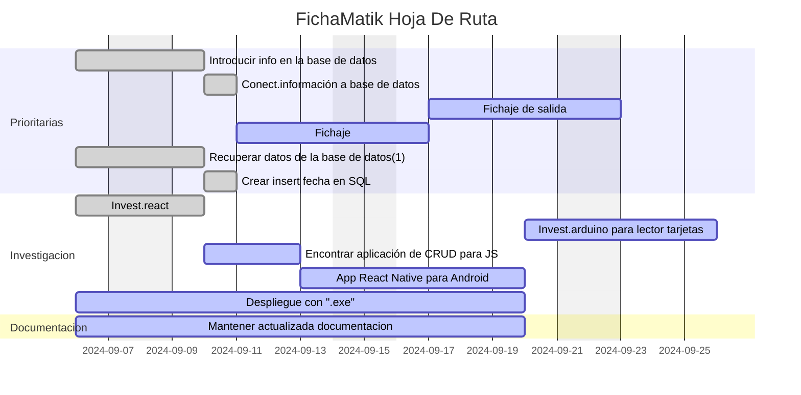

# FichaMatik

Solución pensada para pequeñas y medianas empresas. Esta App permite tanto un fichaje rápido para los trabajadores como un control y filtrado sencillo e intuitivo de la información más relevante para el empresario; como los datos de su equipo, sus horas trabajadas o un resumen semanal y mensual de las mismas.

## Notas para todos

### Arrancar el proyecto

- Es necesario tener una BBDD. puedes encontrar un ejemplo en ```fichamatik.sql```

- Configura ```src/database.js```con tus datos de conexión
- Configura ```src/server.js```con tus puerto preferido (3000 por defecto)
- Instala las dependencias de node con  ```npm install```
- Después vamos a usar el comando ```npm start```

> [!TIP]
> Si queremos cambiar el servidor para que funciones en diferentes redes, entraremos en /main.js y en const server ```http://192.168.1.1``` servidor de localhost.

### Panel de anuncios y comentarios

- **Muscardina** &rarr; Aquí podéis incluir comentarios, preguntas y peticiones que queréis uqe todo el mundo pueda leer, así nos comunicaremos de forma más ordenada. Incluid vuestro nombre si lo hacéis, porfa.

- **Muscardina** &rarr; Jesus ha subido a la rama lab2 una alternativa que si ficha de salida, aunque un poco raro. Cabe la posibbilidad de intentar hacer una mezcla tomando las partes que nos interesan.

## ÉPICA:

*Historia de usuario*: Como programadores, queremos crear una APP que de una solución integral a PYMES para llevar el control de las entradas, salidas y número de horas trabajadas porque *NADIE*, **NUNCA**, ***JAMÁS***, ha solucionado ese asunto antes.

### LISTA DE PROBLEMAS:

- Decidir qué queremos que nuestra APP haga como mínimo para ser viable y decidirnos por una interfaz.
- Comenzar nuestra documentación redactando un backlog en markdown usando Mermaid. Mantenerlo actualizado y no dejar que le salgan telarañas para que sea una guia útil para todo el equipo.
- Aprender a usar Mermaid es interesante para eso...  
- Tener más claro el roadmap, crear uno y mantenerlo actualizado a su vez.
- Módulo que haga operaciones de CRUD y funcione en javascript.
- Entender a nivel de código cómo funcionan los login y log out de usuario cuando se comunica el frontend con la base de datos.
- Adaptar nuestra APP para usarla con bases de datos Sql, así que tenemos que investigar porque React native y React no son compatibles con Sql. Aprender a usar Electron y aplicarlo en nuestra APP.

### REPARTO DE TAREAS:

- Decidir qué queremos que nuestra APP haga como mínimo para ser viable y decidirnos por una interfaz &rarr; **Muscardina**
- Que comenzar nuestra documentación redactando un backlog en markdown usando Mermaid. Mantenerlo actualizado y no dejar que le salgan telarañas para que sea una guia útil para todo el equipo &rarr; **Muscardina, JGHJaime**
- Aprender a usar Mermaid es interesante para eso... &rarr; **JGHJaime, Muscardina**
- Tener más claro el roadmap, crear uno y mantenerlo actualizado a su vez &rarr; **Muscardina, JGHJaime**
- Un módulo que haga operaciones de CRUD y funcione en javascript &rarr; **cristianbrujo, Viviana**
- Entender a nivel de código cómo funcionan los login y log out de usuario cuando se comunica el frontend con la base de datos &rarr; **Hermesgb, Vainilatea, Ddebyef93, erjara66**
- Adaptar nuestra APP para usarla con bases de datos Sql, así que tenemos que investigar porque React native y React no son compatibles con Sql. Aprender a usar Electron y aplicarlo en nuestra APP permitirá que nuestra aplicación sea multiplataforma, incluyendo MAC &rarr; **nicogalvang**

## Hoja de ruta

Solución pensada para pequeñas y medianas empresas. Esta App permite tanto un fichaje rápido para los trabajadores como un control y filtrado sencillo e intuitivo de la información más relevante para el empresario; como los datos de su equipo, sus horas trabajadas o un resumen semanal y mensual de las mismas.


